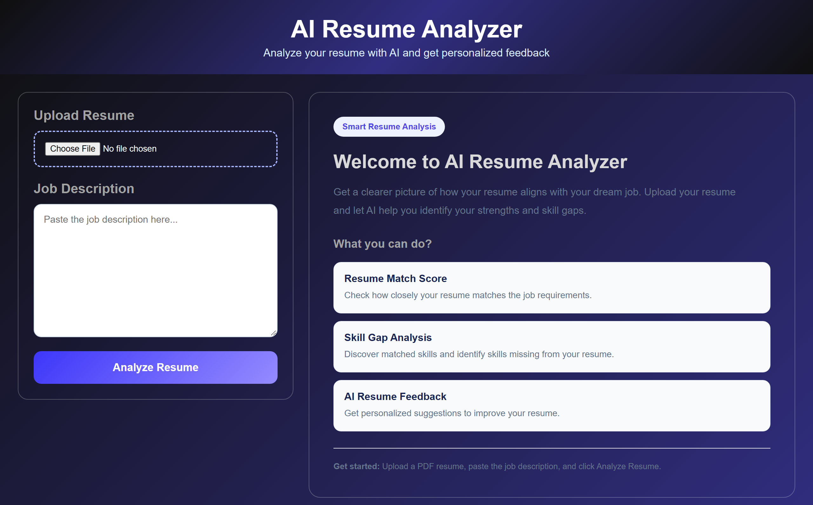
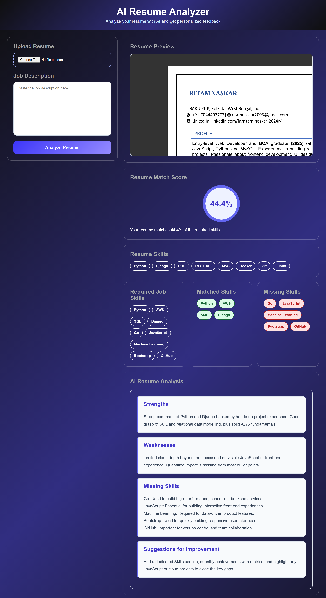

# AI Resume Analyzer

An AI-powered web application that compares your resume against a job description.
Upload a PDF resume, paste the job description, and get a **match score**, a
**skill-gap analysis** (matched vs. missing skills), and **personalized AI feedback**
generated by a large language model.

Built with **Flask** and powered by the **Groq** API.

---

## Preview

**Welcome screen**



**Analysis results (match score, skill-gap analysis & AI feedback, with resume preview)**



---

## Features

- **Resume Match Score** – See how closely your resume matches the job requirements with a percentage score.
- **Skill Gap Analysis** – Automatically detects the skills present in your resume and highlights the ones missing for the role.
- **Resume Preview** – View your uploaded PDF right inside the dashboard, next to your results.
- **AI Resume Feedback** – Get a structured, plain-text analysis with Strengths, Weaknesses, Missing Skills (with reasoning), and Suggestions for Improvement.
- **Clean Dashboard UI** – A responsive single-page dashboard with an animated "scanning" state while the analysis runs.

---

## How It Works

```
Upload PDF resume + Job description
        │
        ▼
Extract text from the PDF            (src/resume_parser.py  -> PyPDF2)
        │
        ▼
Extract skills from the resume       (src/resume_parser.py  -> regex section match)
        │
        ▼
Extract required skills from the JD  (src/job_matcher.py    -> keyword list)
        │
        ▼
Calculate match score                (src/scoring.py        -> matched / missing)
        │
        ▼
AI analysis (Strengths, Weaknesses,  (src/ai_analyzer.py    -> Groq LLM)
Missing Skills, Suggestions)
        │
        ▼
Render results on the dashboard      (templates/index.html)
```

---

## Project Structure

```
Resume_analyzer/
├── app.py                     # Flask entry point and routes
├── requirements.txt           # Python dependencies
├── .env                       # GROQ_API_KEY (not committed)
├── .gitignore
├── README.md
├── data/
│   └── resume.pdf             # Sample resume used for testing
├── src/
│   ├── resume_parser.py       # PDF text extraction + resume skill extraction
│   ├── job_matcher.py         # Extracts required skills from the job description
│   ├── scoring.py             # Computes match score, matched & missing skills
│   └── ai_analyzer.py         # Groq LLM powered resume analysis
├── templates/
│   └── index.html             # Dashboard UI (Jinja2 template)
├── static/
│   ├── style.css              # Dashboard styling
│   └── script.js              # Scanning animation + AI result formatting
├── screenshots/
│   ├── website.png            # Welcome screen screenshot (README)
│   └── dashboard.png          # Analysis results screenshot (README)
└── uploads/                   # Uploaded resumes are stored here (git-ignored)
```

---

## Tech Stack

| Layer         | Technology                       |
| ------------- | -------------------------------- |
| Backend       | Flask (+ Werkzeug)               |
| PDF Parsing   | PyPDF2                           |
| AI / LLM      | Groq API (`openai/gpt-oss-20b`)  |
| Config        | python-dotenv                    |
| Frontend      | HTML, CSS, JavaScript (Jinja2)   |
| Server        | Gunicorn (WSGI, for deployment)  |

---

## Getting Started

### Prerequisites

- Python 3.11+ (the pinned `pandas==3.0.5` requires Python ≥ 3.11; `Flask==3.1.2` requires ≥ 3.9)
- A Groq API key (get one free at <https://console.groq.com/keys>)

### 1. Clone the repository

```bash
git clone https://github.com/RitamNaskar11/Resume_analyzer.git
cd Resume_analyzer
```

### 2. Create and activate a virtual environment

**Windows (PowerShell):**

```powershell
python -m venv venv
.\venv\Scripts\Activate.ps1
```

**macOS / Linux:**

```bash
python3 -m venv venv
source venv/bin/activate
```

### 3. Install dependencies

Install everything from `requirements.txt`:

```bash
pip install -r requirements.txt
```

The file pins the following packages:

| Package        | Version | Purpose                          |
| -------------- | ------- | -------------------------------- |
| Flask          | 3.1.2   | Web framework and routing        |
| PyPDF2         | 3.0.1   | PDF text extraction              |
| groq           | 1.7.0   | Groq API client for the LLM      |
| python-dotenv  | 1.2.3   | Loads `GROQ_API_KEY` from `.env` |
| gunicorn       | 26.2.0  | Production WSGI server           |
| pandas         | 3.0.5   | Data utilities                   |
| matplotlib     | 3.11.1  | Plotting library                 |

### 4. Configure the API key

Create a `.env` file in the project root:

```env
GROQ_API_KEY=your_groq_api_key_here
```

> The application reads this value via `os.getenv("GROQ_API_KEY")`.

### 5. Run the application

```bash
python app.py
```

Then open your browser at:

```
http://127.0.0.1:5000
```

### 6. Deploy (optional)

`requirements.txt` includes **Gunicorn**, so the app can also run behind a WSGI
server on a host such as Render:

```bash
gunicorn app:app
```

Set the `GROQ_API_KEY` environment variable in your hosting provider's dashboard.

---

## Usage

1. Open the app and upload your resume as a **PDF**.
2. Paste the **job description** into the text area.
3. Click **Analyze Resume**.
4. Review the results on the dashboard:
   - **Resume Preview** — your uploaded PDF, embedded in the page.
   - **Match Score** (%)
   - **Resume Skills** / **Required (Job) Skills**
   - **Matched Skills** and **Missing Skills**
   - **AI Resume Analysis** — Strengths, Weaknesses, Missing Skills, and Suggestions for Improvement.

---

## API Routes

| Method | Route                 | Description                                                   |
| ------ | --------------------- | ------------------------------------------------------------- |
| GET    | `/`                   | Renders the dashboard (with results if an analysis exists)    |
| POST   | `/analyze`            | Accepts the resume + job description and runs the analysis     |
| GET    | `/uploads/<filename>` | Serves an uploaded resume file (used for the in-page preview)  |

---

## Notes & Limitations

- Resumes must be in **PDF** format and contain an extractable text layer (scanned/image-only PDFs will not work without OCR).
- Resume skill extraction relies on a dedicated **"Skills"** section in the resume; resumes without such a heading may return few or no skills.
- Job skill extraction matches against a **predefined keyword list** in `src/job_matcher.py` — currently: Python, AWS, SQL, C++, Django, Go, JavaScript, Machine Learning, Bootstrap, and GitHub. Extend this list to support more technologies.
- The AI analysis requires a valid `GROQ_API_KEY`; the rest of the pipeline works without it.

---

## Contributing

Contributions are welcome. Feel free to fork the repository, open an issue, or submit a pull request with improvements.

---

## License

This project is open source. Add a `LICENSE` file if you plan to distribute it under a specific license.